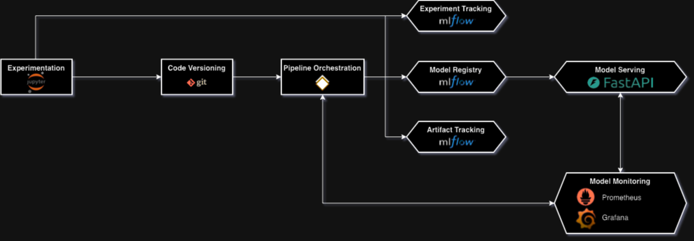
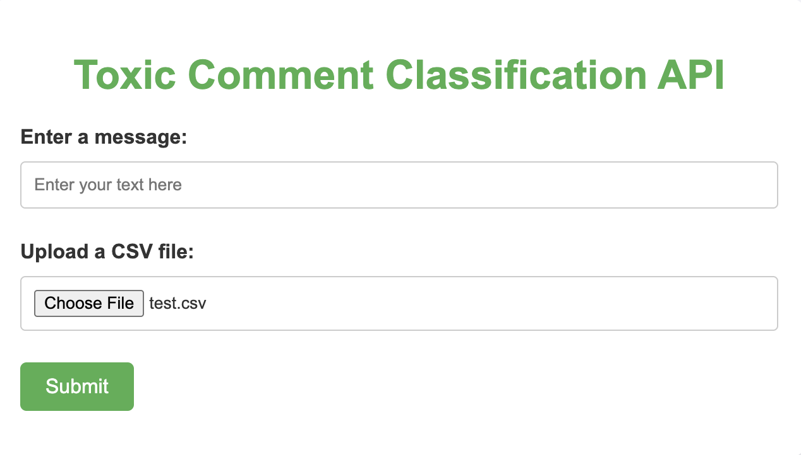
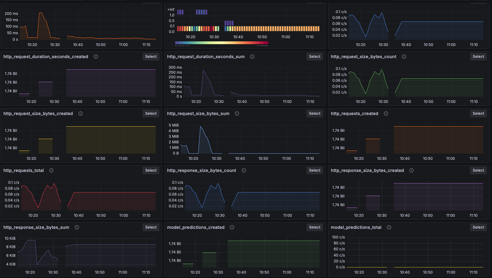

# Applying Kedro Orchestration Pipelines to Deploy a Deep Learning Transformer Architecture for the Toxic Comment Classification Problem

[](https://kedro.org)


## Project Overview

This project leverages Kedro, a data and machine learning pipeline orchestration tool, to classify toxic comments using deep learning transformer architecture. It integrates Kedro-Viz for pipeline visualization and follows data engineering best practices for reproducibility and maintainability.

### Key Features

- **Pipeline Visualization**: Integrates Kedro-Viz to provide an interactive visual representation of data workflows for better debugging and workflow comprehension.
- **Multilingual Dataset Support**: Handles multilingual datasets, including English, with preprocessing pipelines optimized for transformer models.
- **Transformer-Based Modeling**: Supports state-of-the-art deep learning models, such as BERT, for toxicity prediction.

### Tech Stack

- Kedro `v0.19.10`
- TensorFlow for model training
- FastAPI for serving predictions
- MLflow for experiment tracking
- Docker for containerization
- Prometheus and Grafana for monitoring

For more information, see the [Kedro documentation](https://docs.kedro.org).

---

## System Design



---

## Kedro Pipeline Overview


---

## Dataset Overview

This project utilizes datasets from the Jigsaw ["Toxic Comment Classification"](https://www.kaggle.com/competitions/jigsaw-multilingual-toxic-comment-classification/data?select=test.csv) competition. The datasets include labeled comments sourced from platforms like Wikipedia and Civil Comments.

Description:

- Comment text: The primary data containing user-submitted comments;
- Toxic Column: A binary label where `1` indicates toxic comments, and `0` indicates non-toxic comments.

After that, you need to download the follow files:

- `jigsaw-toxic-comment-train.csv`;
- `validation.csv`;
- `test.csv`.

For all the files, add in the follow path: `data/01_raw/`

---

## Rules and guidelines

To ensure consistency and reproducibility:

1. **.gitignore Compliance**: Do not remove any lines from the provided `.gitignore` file.
2. **Data Engineering Convention**: Follow [Kedro's data engineering conventions](https://docs.kedro.org/en/stable/faq/faq.html#what-is-data-engineering-convention).
3. **Data Handling**: Do not commit raw datasets to the repository.
4. **Credential Security**: Avoid committing credentials or local configurations to the repository. Store these in `conf/local/`.

---

## Get started

### Installation

Install the required dependencies:

```bash
pip install -r requirements.txt
```

### Running the Pipeline

Execute the Kedro pipeline:

```bash
kedro run
```

### Testing the Pipeline

Run tests using `pytest`:

```bash
pytest
```

### Deploying the Model API

To serve the champions model, you can build the container `toxic-comment-endpoint` using the `fastapi` package for serving.

1. Build the Docker image:

   ```bash
   docker build -t toxic-comment-endpoint .
   ```

2. Run the Docker container:

   ```bash
   docker run -p 8001:8001 -e PORT=8001 toxic-comment-endpoint
   ```

3. Click on the link `http://0.0.0.0:8001` and you see the follow web application

    

---

## Monitoring with Prometheus and Grafana

Create a `prometheus.yml` file for monitoring and sending metrics to Grafana:

```yml
global:
  scrape_interval: 15s

scrape_configs:
  - job_name: "fastapi"
    metrics_path: "/metrics"
    static_configs:
      - targets: ["0.0.0.0:8001"]

remote_write:
  - url: "<YOUR_GRAFANA_URL>"
    remote_timeout: "30s"
    send_exemplars: false
    follow_redirects: true
    basic_auth:
      username: "<YOUR_USERNAME>"
      password: "<YOUR_API_TOKEN>"
```

Run Prometheus with the configuration file:

```bash
prometheus --config.file=prometheus.yml
```

### Grafana Visualization




## Additional Resources

- [Kedro Documentation](https://docs.kedro.org)
- [TensorFlow Documentation](https://www.tensorflow.org)
- [FastAPI Documentation](https://fastapi.tiangolo.com)
- [MLflow Documentation](https://mlflow.org)
- [Prometheus Documentation](https://prometheus.io)
- [Grafana Documentation](https://grafana.com)
