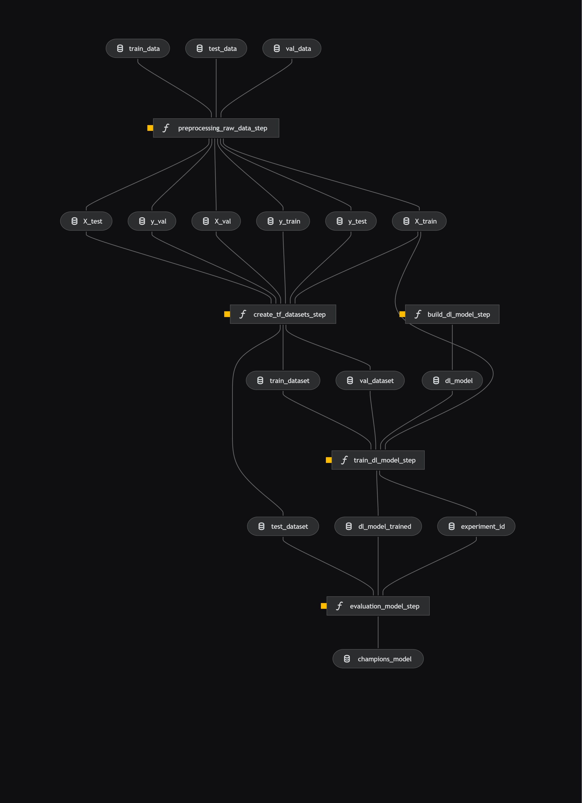

# Applying Kedro Orchestration Pipelines to Deploy a Deep Learning Transformer Architecture for the Toxic Comment Classification Problem

[](https://kedro.org)


## Project Overview

This Kedro project, equipped with Kedro-Viz integration, has been developed to analyze and classify textual data from toxic comment datasets. The project's objective is to facilitate machine learning workflows for predicting the toxicity of comments across multiple datasets, leveraging structured pipelines and reproducible data engineering practices. The kedro version `kedro 0.19.10`. For more information take a look at the [Kedro documentation](https://docs.kedro.org).

### Key Features

- Kedro-Viz Setup: Provides visual representation of the data pipelines to improve workflow comprehension and debugging.
- Flexible Dataset Management: Handles multiple datasets, including English and multilingual data, designed for toxic comment classification.
- BERT-Ready Data: Preprocessed datasets for compatibility with transformer-based models like BERT.

## Pipeline Overview



## Dataset Overview

This project incorporates datasets from the Jigsaw ["Toxic Comment Classification"](https://www.kaggle.com/competitions/jigsaw-multilingual-toxic-comment-classification/data?select=test.csv). The datasets include labeled comments sourced from platforms like Wikipedia and Civil Comments.

Description:
    - Comment text: the primary focus, containing the actual text of comments;
    - Toxic Column: Indicates whether the comment is toxic (`1`) or non-toxic (`0`).

## Rules and guidelines

In order to get the best out of the template:

- Don't remove any lines from the `.gitignore` file we provide
- Make sure your results can be reproduced by following a [data engineering convention](https://docs.kedro.org/en/stable/faq/faq.html#what-is-data-engineering-convention)
- Don't commit data to your repository
- Don't commit any credentials or your local configuration to your repository. Keep all your credentials and local configuration in `conf/local/`

## How to install dependencies

Declare any dependencies in `requirements.txt` for `pip` installation.

To install them, run:

```bash
pip install -r requirements.txt
```

### How to run your Kedro pipeline

You can run your Kedro project with:

```bash
kedro run
```

### How to test your Kedro project

Have a look at the files `src/tests/test_run.py` and `src/tests/pipelines/data_science/test_pipeline.py` for instructions on how to write your tests. Run the tests as follows:

```bash
pytest
```

To configure the coverage threshold, look at the `.coveragerc` file.

